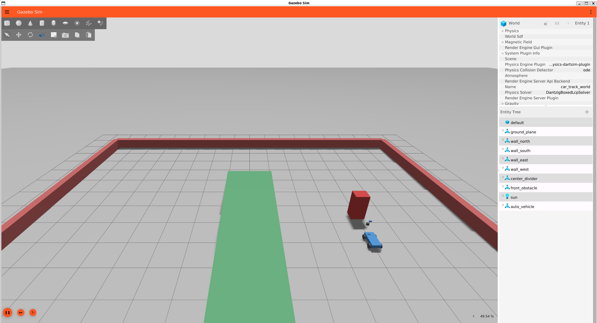
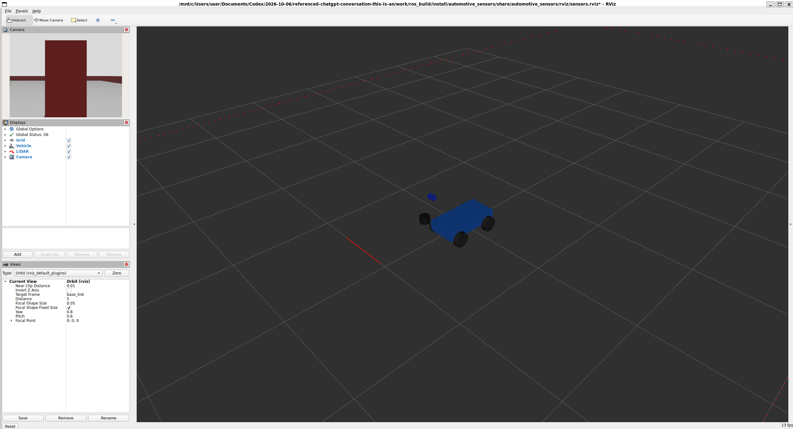
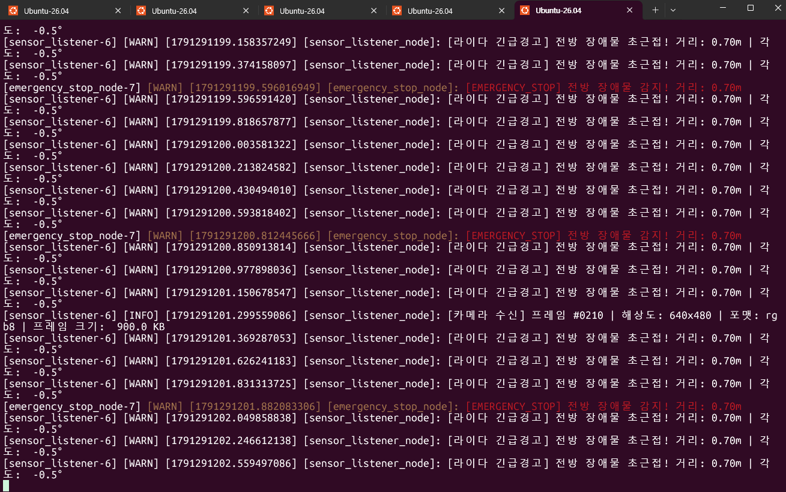
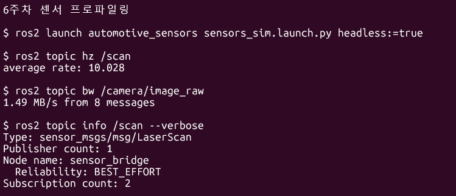

# 오토모티브SW프로그래밍 누적 실습 (2~6주차)

ROS 2 차량 예제를 주차별 패키지로 정리한 프로젝트입니다.

## 1. 프로젝트 설명

이 프로젝트는 차량형 ROS 2 예제를 2주차 Publisher–Subscriber 실습에서 시작해 URDF/Xacro 모델링, Gazebo 시뮬레이션, TF 좌표 변환, 센서 QoS와 긴급 정지 처리까지 연결한 누적 실습입니다. 각 주차 패키지는 독립적으로 실행할 수 있고, 6주차 패키지는 차량 모델·센서·브리지·RViz·긴급 정지 노드를 하나의 launch 파일로 실행합니다.

### 주요 코드와 파일 역할

| 파일 | 역할 |
| --- | --- |
| `src/week02/my_vehicle_pkg/my_vehicle_pkg/simple_publisher.py` | 1초마다 차량 속도를 `/vehicle_status`에 발행 |
| `src/week02/my_vehicle_pkg/my_vehicle_pkg/simple_subscriber.py` | `/vehicle_status`를 구독해 수신한 속도를 로그로 출력 |
| `src/week03/my_vehicle_description/urdf/vehicle.urdf.xacro` | 차량 링크·조인트와 바퀴 모델을 정의 |
| `src/week03/my_vehicle_description/launch/display.launch.py` | 차량 모델을 `robot_state_publisher`와 RViz로 표시 |
| `src/week04/my_vehicle_gazebo/launch/spawn_car.launch.py` | Gazebo 월드와 차량 모델을 실행하고 차량을 생성 |
| `src/week04/my_vehicle_gazebo/config/bridge.yaml` | Gazebo와 ROS 2 사이의 시계·센서·차량 토픽 연결 설정 |
| `src/week05/automotive_tf/automotive_tf/static_tf_broadcaster.py` | `base_link`와 `lidar_link` 사이의 고정 TF 발행 |
| `src/week05/automotive_tf/automotive_tf/dynamic_tf_broadcaster.py` | 원형 주행 위치를 계산해 `odom`에서 `base_link`로 동적 TF 발행 |
| `src/week05/automotive_tf/automotive_tf/tf_listener.py` | TF 버퍼에서 `odom`과 `lidar_link` 변환을 조회 |
| `src/week06/automotive_sensors/launch/sensors_sim.launch.py` | Gazebo, 센서 브리지, 차량 상태, 긴급 정지 노드, RViz를 통합 실행 |
| `src/week06/automotive_sensors/urdf/vehicle_sensors.xacro` | 차량에 LiDAR·RGB 카메라·IMU 링크와 센서를 추가 |
| `src/week06/automotive_sensors/config/sensor_bridge.yaml` | Gazebo 센서 토픽과 ROS 2 토픽, 센서 데이터 QoS를 연결 |
| `src/week06/automotive_sensors/worlds/sensor_track.sdf` | 차량과 전방 장애물이 배치된 센서 실험 환경을 정의 |
| `src/week06/automotive_sensors/rviz/sensors.rviz` | 차량 프레임과 LiDAR·카메라 표시 설정 |
| `src/week06/automotive_sensors/automotive_sensors/answer/emergency_stop_node.py` | `/scan`의 정면 영역을 검사해 긴급 정지 경고와 `/emergency_stop` 상태 발행 |
| `src/week06/automotive_sensors/test/test_emergency_stop.py` | 정면·측면·무효 거리·파라미터 조건을 시험 |

## 주차별 구성

| 주차 | 폴더 | 내용 |
| --- | --- | --- |
| 2주차 | `src/week02/my_vehicle_pkg` | `/vehicle_status` 발행·구독 및 실행 파일 |
| 3주차 | `src/week03/my_vehicle_description` | 차량 URDF/Xacro, RViz 표시 |
| 4주차 | `src/week04/my_vehicle_gazebo` | 차량 모델, Gazebo 월드, bridge, spawn |
| 5주차 | `src/week05/automotive_tf` | 정적·동적 TF 발행, TF 조회 |
| 6주차 | `src/week06/automotive_sensors` | LiDAR, RGB 카메라, IMU, 긴급 정지 경고, RViz 표시 |

`screenshots/`에는 센서 프로파일링, Gazebo, RViz, 긴급 정지 경고 실행 화면을 넣었습니다.

## 확인한 실행 환경

- Ubuntu 26.04 (WSL), ROS 2 Lyrical, Gazebo Sim 10.5.0
- `ros_gz_sim`, `ros_gz_bridge`, `rviz2`, `xacro`, `robot_state_publisher`, `joint_state_publisher`, `tf2_tools`
- 2026-10-06 로컬 검증: 5개 패키지 빌드 성공, 6주차 Xacro 및 SDF 검사 성공, 경고 로직 시험 4건 통과

ROS 2와 Gazebo가 설치된 Ubuntu 터미널에서 저장소 루트로 이동해 다음을 실행합니다.

```bash
source /opt/ros/lyrical/setup.bash
colcon build --base-paths src
source install/setup.bash
```

### 주차별 실행

```bash
ros2 launch my_vehicle_pkg vehicle_demo.launch.py
ros2 launch my_vehicle_description display.launch.py
ros2 launch my_vehicle_gazebo spawn_car.launch.py
ros2 launch automotive_tf tf_demo.launch.py
ros2 launch automotive_sensors sensors_sim.launch.py
```

각 명령은 별도 실습으로 하나씩 실행합니다. 6주차에서 그래픽 화면 없이 센서 통신만 확인할 때는 `ros2 launch automotive_sensors sensors_sim.launch.py headless:=true`를 사용합니다. GUI 환경에서 RViz의 렌더 창 오류가 생기면 `QT_QPA_PLATFORM=xcb`를 앞에 붙여 실행합니다.

### 6주차 센서 시뮬레이션

- Gazebo에서 차량과 전방 장애물을 실행하고 LiDAR `/scan`, RGB 카메라 `/camera/image_raw`, IMU `/imu/data`를 확인합니다.
- `/scan`은 센서 데이터 QoS인 `BEST_EFFORT`로 발행되며, 긴급 정지 노드는 정면 ±20° 안에서 1.0 m 이하의 유효한 거리값을 감지합니다.
- 조건을 만족하면 `[EMERGENCY_STOP] 전방 장애물 감지!` 경고를 출력하고 `/emergency_stop`에 `std_msgs/msg/Bool` 상태를 발행합니다.
- 정면 각도와 정지 거리는 `front_angle_deg`, `stop_distance_m` 인자로 바꿀 수 있습니다.
- RViz 설정은 차량 모델과 LiDAR·카메라 센서를 표시합니다.

### 센서 프로파일링

6주차 시뮬레이션을 실행한 상태에서 다음 명령으로 센서 주기와 대역폭을 확인합니다.

```bash
source /opt/ros/lyrical/setup.bash
source install/setup.bash
ros2 topic hz /scan
ros2 topic bw /camera/image_raw
ros2 topic info /scan --verbose
```

실행 확인 결과 `/scan`은 약 **10 Hz**, `/camera/image_raw`는 **1.49 MB/s**, `/scan` 발행자 Reliability는 **BEST_EFFORT**였습니다. 터미널 화면은 [`screenshots/sensor_profiling.png`](screenshots/sensor_profiling.png)에 있습니다.

## 실행 화면

### Gazebo 차량과 전방 장애물



### RViz 차량·LiDAR·카메라



### 긴급 정지 경고



### 센서 주기·대역폭·QoS



## AI 사용 및 직접 보강 기록

AI 사용 내용:
- ROS2/Gazebo 센서 연결과 실행 오류 원인 분석처럼 복잡한 부분에 도움을 받았다.
- 실행 명령, 폴더 구조, README 표현을 정리하는 데 일부 활용했다.
- README를 읽기 쉽고 깔끔하게 개선하는 과정에도 도움을 받았다.
- 최종 기준과 수정 내용은 강의자료와 실제 실행 결과를 확인해 반영했다.

**본인이 직접 보강한 내용:** 6주차 과제 요구사항으로 구현한 긴급 정지 기능에 추가로, 고정된 정면 각도와 거리 기준을 `front_angle_deg`, `stop_distance_m` ROS 2 파라미터로 조정할 수 있도록 보강했다. 또한 콘솔 경고만 출력하던 동작에 `/emergency_stop` Boolean 상태 토픽을 추가해 다른 제어 노드가 정지 상태를 사용할 수 있도록 확장했다. 파라미터가 변경된 경우에도 정면·측면·무효 거리 조건이 올바르게 처리되는지 시험 코드로 확인했다.
